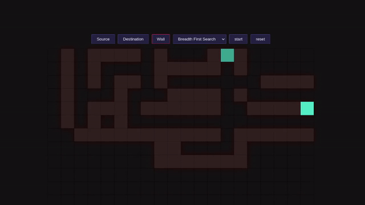

# Solid Graph Visualiser

[[View Demo](https://adarshhegde.github.io/solid-graph-visualiser/)]

* This is a project built by Adarsh Hegde for learning the core principles of SolidJS.
* Graph algorithms such as DFS, BFS etc. are visualised in a easy to understand manner in this project.
-----
- Built with SolidJS frontend framework, having the ability visualize DFS, BFS, and other graph based algorithms.
- Allowed me to practice my skills in DOM based animation and efficient ways to update the application state.
- More algorithms to be added in future revisions

#### Example for DFS

  

#### Example for BFS

  
